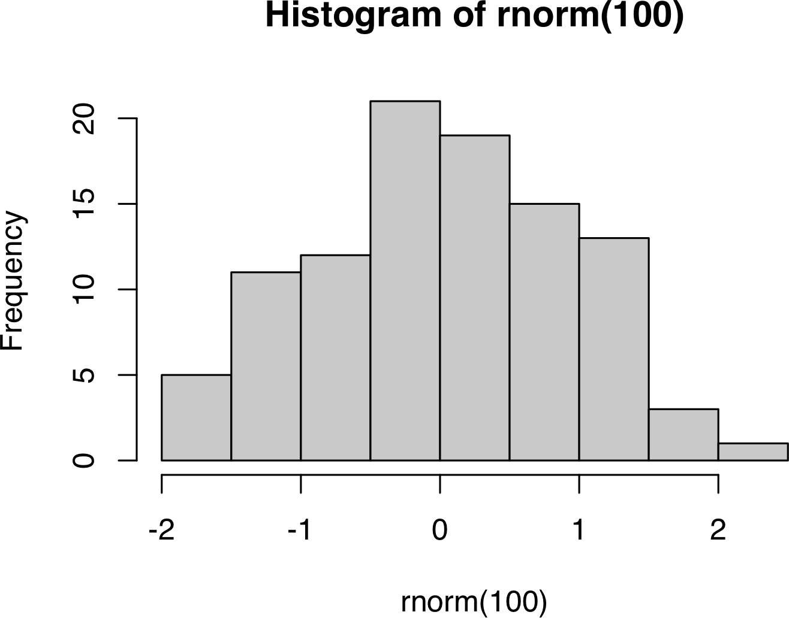

```{r setup, include=FALSE}
# params:
#   i: "`r i`"
# includes:
#   in_header: "preamble.tex"
library(knitr)
library(ggplot2)
library(gridExtra)
library(grid)
library(dplyr)
library(magrittr)
library(tidyr) # gather
library(tibble) # rowtocolumn
library(kableExtra) # kable
library(Rcpp)
library(RcppArmadillo)
library(inline) # masked from ‘package:Rcpp’ registerPlugin
library(microbenchmark) # microbenchmark timings
library(RcppParallel)
library(RInside)
library(data.table) # fread
library(foreach) # foreach
library(parallel) # mclapply
library(doParallel)
registerDoParallel(cores = 6)
library(rstan)
library(devtools)
# install_github('jr-packages/stanhl')
# install_github('JakeJing/stanhl')
# Note: this only works for python3; need to first install `pip3 install Pygments`; and `xcode-select --install`
library(pdftools) # tikz
library(tikzDevice) # tikz device
library(purrr)
# devtools::install_github("r-lib/conflicted")
library(conflicted)
# use_python('/usr/local/bin/python3')
# library(JuliaCall) # julia engine
knit_hooks$set(crop = hook_pdfcrop, pars = function(before, options, envir) {
  if (before) {
    par(family = my.font)
  } else {
    NULL
  }
})
opts_chunk$set(
  fig.path = "figures/",
  dev = "quartz_pdf", # better for plot resolution than cairo_pdf
  # dev = "png",
  # dpi = 300,
  dev.args = list(bg = "white"), # or quartz_pdf (for lattice)
  fig.height = 5,
  fig.width = 6,
  # engine.path = list(python = '/usr/local/bin/python3',julia = '/Applications/Julia-1.5.app/Contents/Resources/julia/bin'),
  # python.reticulate = T, # not necessary, if use_python() is used above
  message = F,
  warning = F,
  autodep = T,
  cache.comments = F,
  crop = T,
  comment = NA,
  pars = T
)
# graphics setup:
my.font <- "Helvetica"
# ggplot
theme_set(theme_bw(base_size = 24) +
  theme(
    text = element_text(family = my.font),
    plot.background = element_rect(fill = "transparent", colour = NA)
  ))
options(width = 180, knitr.kable.NA = "", knitr.table.format = "latex")
# citations_1 <- tempfile(fileext = ".bib")
# file.copy(from = here::here("/Users/jakejing/switchdrive/bib/references.bib"), to = citations_1)
```
```{r color the stan code chunk and conflict preferences, results='asis', echo = F}
library(devtools) # source_url
# check internet connection
if(RCurl::url.exists("https://github.com/")){
  source_url("https://raw.githubusercontent.com/JakeJing/conflict_prefer/main/conflict_prefer.R") # library(conflicted) has been included in the script
  source_url("https://raw.githubusercontent.com/JakeJing/knitr-markdown-engines/master/templates/stan_highlight/stan_hl.R")
  # You need to run it before the stan code chunk
}else{
  warning("No internet connection!")
}
library(stanhl)
stanhl_init()
```

\clearpage

Introduction
============

For large files, we can cache the file, and use `cache.lazy = T` to reuse the pre-computed results. To avoid overwriting the previously cached file, it is better to set the `cache= F`, when you want to use cachy.lazy to get the previously saved results. In this case, you do not need to cache the file again. You can also load the cached file, and check the environment to see whether the variables have already been saved.

If `cache = T`, knitr will skip the execution of this code chunk if it has been executed before and nothing in the code chunk has changed since then. This is particularly useful when you want to reuse the figure (time-consuming). **When you modify the code chunk (e.g., revise the code or the chunk options), the previous cache will be automatically invalidated, and knitr will cache the chunk again.**

You can also use cross-reference for a section \@ref(sec:data-method).

You can also cite a paper like this [@Kirby2016].

```{r print, cache.path = "cache/", cache=T}
print("Hello R markdown!")
```


Data and Methods {#sec:data-method}
============

```{Rcpp, eval = F}
#include <Rcpp.h>
using namespace Rcpp;
// [[Rcpp::export]]
NumericVector timesTwo(NumericVector x) {
  return x * 2;
}
```

```{r, eval = F}
timesTwo(10) # test function in R chunk or console
```


```{r results='asis', echo = F}
stanhl_file("./stanscripts/stan_binom.stan")
# mod <- stan_model(file="./stanscripts/stan_binom.stan", verbose = TRUE)
```

Results
========

<!-- Here is the
multiple line comments
-->

We can also save the plot as png files, by setting the dev = "png", and change the quality of the picture by setting dpi = 300.

Alternatively, you can convert all the saved pdfs into pngs with imagemagick in terminal:

convert -density 150 *.pdf -quality 100 -set filename:basename "%[basename]" "%[filename:basename].png"


Cross-reference of figures, tables and equations
------------------------------------------------


```{r histogram-rng, dev = "png", dpi = 300, fig.width=5, fig.height=4, fig.cap="Histogram plot", echo = F}
hist(rnorm(100))
```

We can also co-refer a plot in Figure \@ref(fig:histogram-rng). **Note:** you need to set `include = T` when producing the plot. Otherwise, the co-reference won't work. Pls avoid using underscore (`_`) or white space in the co-reference labels. Likewise, you can also use `\@ref(tab/eq:)` to refer to the specific table or equation. See Figure \ref{fig:CTMCgraphs}.


<!-- {width=90% height=80%} -->

```{r fig.cap="Histogram plot from \\textcite{Rcore2020}", out.width = '100%', out.height="80%", fig.align="center", echo = T, eval = F}
# two ways of include a picture in R
# {width=90% height=80%}

```

Citations
-----------


You can cite a paper in Rmarkdown in different ways, e.g., if you want to have the citation with exact page number. You can use the following ways [see @Jing2022, p.45] or @Jing2022 [pp. 404].


Discussion
==========

```{tikz, simpletikz, fig.cap = "Tikz graph example", fig.ext = 'pdf', eval = T, echo = F}
\usetikzlibrary{arrows}
\begin{tikzpicture}[node distance=2cm, auto,>=latex', thick, scale = 0.5]
\node (P) {$P$};
\node (B) [right of=P] {$B$};
\node (A) [below of=P] {$A$};
\node (C) [below of=B] {$C$};
\node (P1) [node distance=1.4cm, left of=P, above of=P] {$\hat{P}$};
\draw[->] (P) to node {$f$} (B);
\draw[->] (P) to node [swap] {$g$} (A);
\draw[->] (A) to node [swap] {$f$} (C);
\draw[->] (B) to node {$g$} (C);
\draw[->, bend right] (P1) to node [swap] {$\hat{g}$} (A);
\draw[->, bend left] (P1) to node {$\hat{f}$} (B);
\draw[->, dashed] (P1) to node {$k$} (P);
\end{tikzpicture}
```

Conclusions
==========

**Note:** it seems that tikz does not support both fig.cap and fig.scap at the same time. It may cause fig.cap cannot recognize the latex code.

```{tikz, CTMCgraphs, fig.cap="A example graphs of CTMC model (fig.size cannot be changed via fig.width or fig.height)", fig.align="center", code = xfun::read_utf8("./graphics/CTMC.tex"), echo = F}
```


We can also add the cross-reference inside the figure cation via `\\ref{fig:}`.

```{tikz, simpletikz, fig.cap = "A copy of CTMC model in Figure \\@ref(fig:histogram-rng) or Figure \\ref{fig:histogram-rng} (reuse by its labels; doesn't work for read_utf8)", echo = F}
```


\clearpage

References
==========
